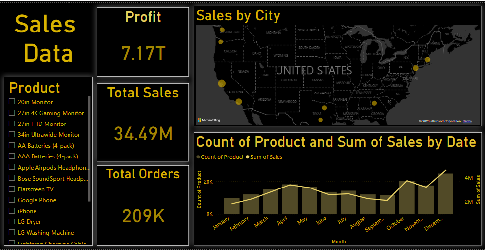

# 📊 Sales Data Dashboard

## 🚀 Overview
This project features an interactive **Sales Data Dashboard** built using **Power BI**, designed to analyze and visualize key business insights. The dashboard provides an in-depth look at:

- **Profit:** Total revenue across all sales.
- **Total Sales:** Overall sales performance.
- **Total Orders:** Number of transactions recorded.
- **Sales by City:** Geographic distribution of sales.
- **Count of Products & Sum of Sales by Date:** Monthly trends in product sales.

---

## 📸 Dashboard Preview

---

## 📂 Dataset
The dataset used for this dashboard is included in the repository:
- **[Sales Data.csv](Sales%20Data.csv)**

---

## 🔧 How to Use
1. Download the repository files.
2. Open **Power BI** and load `Sales Data.csv`.
3. Explore and interact with the dashboard to gain insights.

---

## 🛠 Tech Stack
- **Power BI** – Data Visualization
- **CSV Data Source** – Sales data analysis

---

## 📌 Features
✅ Interactive visualizations  
✅ Sales trends over time  
✅ City-wise sales distribution  
✅ Dynamic filtering and selection  
✅ Clean and intuitive UI  

---

## 📢 Contributing
Want to improve this dashboard? Feel free to fork the repo, make your changes, and submit a pull request!

---

⭐ If you find this project useful, don't forget to give it a **star**! ⭐
